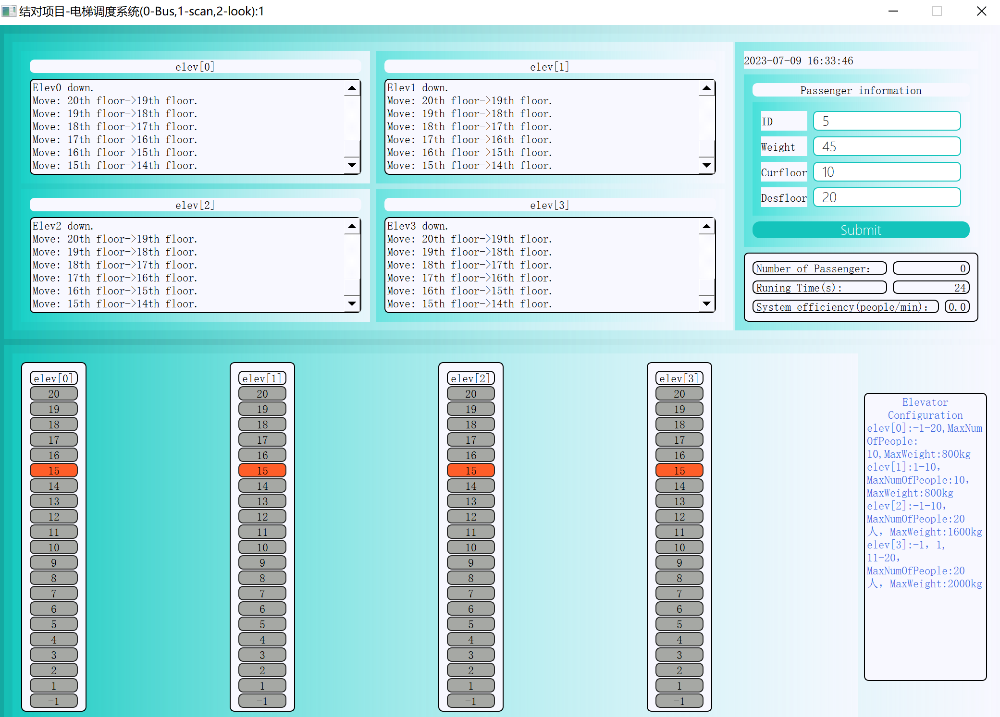
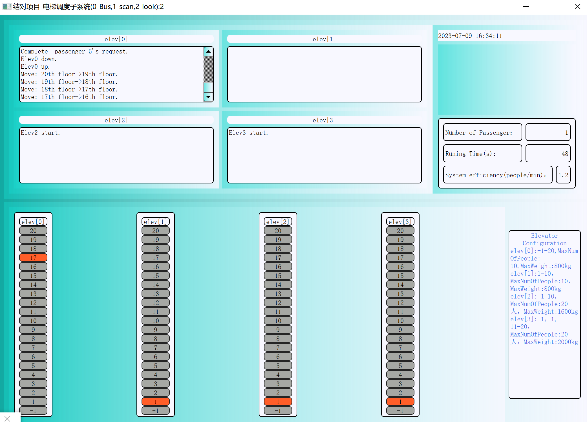
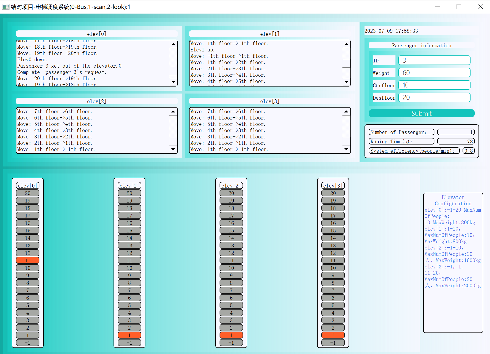
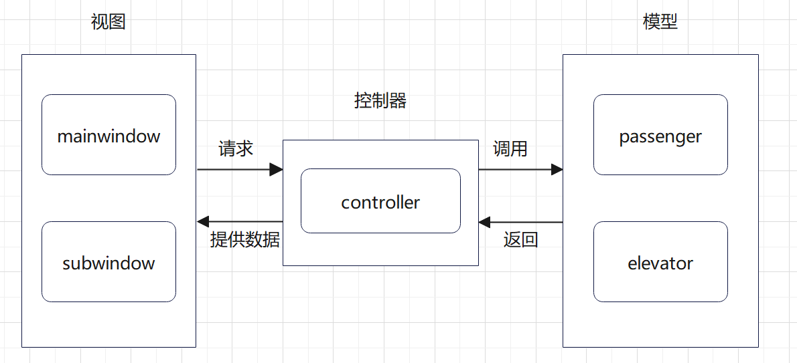

# **结对项目-电梯调度**

by 何宇轩&李蕴文

[toc]

## **〇 项目概述**

### **1 项目背景**

        电梯调度系统是针对多层建筑的垂直交通进行优化和改进的项目。
        随着城市的发展和人口的增加，高楼大厦内电梯数量增多，电梯的调度算法对于提高乘客的出行效率和舒适度变得越发重要。
        在传统的电梯调度系统中，常使用的是基于FCFS（First-Come-First-Served）或Bus的调度策略。然而，简单的调度方法不能高效地满足乘客的需求，经常导致等待时间较长和电梯拥挤的问题。
        因此，本项目旨在设计和实现不同的电梯调度算法，得到更加智能化的电梯调度系统，以提高电梯的运行效率。

### **2 项目目标**

“电梯调度系统”项目的设计目标是搭建一个包含**四部电梯**的大厦电梯调度系统 ，有**独立的运行系统**和**人性化的UI界面**。

+ 保证数据的**安全性、完整性和准确性**。
+ 保证系统的稳定性：系统能够长期稳定运行，并且具有**一定错误处理机制**。
+ 增加电梯的**运行效率**：通过更加合理的调度策略和优化算法，提高电梯的乘客**吞吐量，降低空载率和能耗**。

### **3 关键问题**

+ 电梯调度算法要达到**一定的效率提升**(相比于传统的BUS算法)；
+ 使用**多线程管理**控制四部电梯同时运行，合理梳理各个电梯之间的关系；
+ 接口定义明确，保证各**模块的独立性**，使系统运行时能够正确驱动各个组件
+ 进行各阶段各角度的**测试保证系统的运行正确**；

### **4 项目意义**

+ **提高电梯运行效率**：选择最佳的调度策略来减少电梯的空载运行，提高电梯的负载率，并通过更有效的路线规划和调度来降低电梯的运行时间和能耗。
+ **提升电梯系统稳定性**：通过算法的比较和评估，找到更稳定和可靠的调度策略，降低电梯系统的故障率和维修次数。这有助于减少电梯停运时间，提高电梯系统的可靠性和稳定性。
+ 有助于为**电梯调度技术的创新和发展**提供参考：为电梯调度技术的创新和发展提供实践基础和经验。为推动电梯行业向更智能、高效和安全的方向发展提供一定参考。

## **Ⅰ 问题假设**

    一幢 21 层的大厦，有 4 部电梯，乘客的体重：平均 70kg，最大 120kg，最小 40g）。
    其他的常量包括：电梯的速度，电梯门开关时间，乘客进出电梯的时间。
    大厦的楼层为-1，0，...，20，-1 层是地下停车场，1 层是大厅。以下是 4 部电梯的参数：

| 电梯编号 | 服务楼层        | 乘客人数限制 | 重量限制 |
| -------- | --------------- | ------------ | -------- |
| 1        | 所有楼层        | 10           | 800kg    |
| 2        | 1-10 层         | 10           | 800kg    |
| 3        | -1，1-10 层     | 20           | 1600kg   |
| 4        | -1，1，11-20 层 | 20           | 2000kg   |

## **Ⅱ PSP表格记录**

| Personal Software Process Stages        | 预估耗时（分钟） | 实际耗时（分钟） |
| --------------------------------------- | ---------------- | ---------------- |
| **计划**                                     | **90**                 | **50**                 |
| · 估计这个任务需要多少时间                | 30                 | 10                 |
| **开发**                                     | **1380**                 | **1700**                 |
| · 需求分析 (包括学习新技术)               | 90                 | 80                 |
| · 生成设计文档                           | 120                 | 120                 |
| · 设计复审 (和同事审核设计文档)           | 60                 | 40                 |
| · 代码规范 (为目前的开发制定合适的规范)   | 30                 | 10                 |
| · 具体设计                              | 180                 | 200                 |
| · 具体编码                              | 800                 | 1020                 |
| · 代码复审                              | 180                 | 120                 |
| · 测试（自我测试，修改代码，提交修改）    | 240                 | 150                 |
| **报告**                                    | **240**                 | **150**                 |
| · 测试报告                              | 180                 | 120                 |
| · 计算工作量                            | 30                 | 10                 |
| · 事后总结, 并提出过程改进计划           | 30                 | 20                 |
| **合计**                                    | **1710**                 | **1940**                 |

### **第 1 次迭代**

    当前为第一次需求迭代，我们的工作还未涉及具体编码与测试等，因此与此相关的表项还未填写。
    通过对比可以发现实际工作时间普遍小于预估时间，我们认为可能是目前对于该项目工作量的估计有偏差；或需求分析和接口设计还不够全面细致、花费时间较少，后续会不断完善该部分工作。

### **第 2 次迭代**

    具体编码实际时长较短，因为目前需求内容较为简单，代码实现并不复杂

### **第 3 次迭代**

    代码编写时长明显高于预估值：该阶段代码编写主要目标是实现两个进阶调度算法和测试程序编写。
    我对自身的编码能力存在错误定位，某些环节卡壳，导致总编码时长超出预期

### **第 4 次迭代**

    界面设计预估花费 540 分钟，实际时长为 300 分钟。
    这可能因为界面设计比我们想象中容易；或者我们实现的功能相对简单基础，后续有时间还会继续完善该部分内容。

## **Ⅲ 需求分析**

### **1 功能需求**

+ 乘客能够向系统提交自身信息来发出乘梯请求。系统应能**正确响应每一个合理的乘梯请求**。

+ 系统应根据乘客的楼层请求和电梯的当前状态来**确定优先级**。

+ 系统应根据**乘客的楼层请求**和**电梯的当前状态**来确定调用电梯的优先级。

+ 系统应考虑电梯的最大负荷能力，如果电梯已经满载或无法容纳新的乘客请求，系统应相应调整乘客的楼层请求或分配其他可用的电梯。

+ 在每个楼层的电梯大厅和电梯内部应设有电梯状态显示面板，以显示当前电梯运行、停止、开门、关门的状态和所在楼层。

+ 系统应根据乘客的请求和电梯的位置来确定**最佳响应时间**和**最短路径**。

### **2 性能需求**

+ **响应时间**：电梯调度系统应在乘客请求到达时快速响应。同时，系统应能够在短时间内计算出**最佳电梯分配方案**，优化电梯的运行轨迹和停留时间。

+ **吞吐量**：系统应能够处理多乘客的大量请求，要求支持**并行处理**多乘客请求，以提高整体吞吐量。

+ **可靠性**：系统应具备持续运行并处理乘客请求的能力，能够具有**故障检测**和**容错机制**，以保证系统在长期运行中的可靠性。

+ **界面友好性**：系统的UI界面需要简单美观，布局合理，功能完善，提供系统运行过程中必要的反馈信息，提供**快捷方式**和**回滚操作**，让新用户方便上手

### **3 可行性**

+ **技术可行性**

    采用运行高效的 **C++** 实现具体的编码，算法部分在 **Visual Studio Code** 中开发，UI界面采取 **QT** 开发框架进行开发，分别完成各自的**单元测试**后，最终集成到QT开发框架中，并进行**集成测试**。该框架产生的应用程序可以在 Windows 平台部署，并生成本地运行的项目文件。

+ **操作可行性**

    用户对电梯调度系统的操作易于理解和使用。用户界面的设计和交互方式能够确保用户能够方便地操作和理解电梯调度系统。

## **Ⅳ 模块设计与实现**

### **1 设计理念**

+ **信息隐藏**
  
  该项目至少会涉及乘客、电梯两大板块及其数据集合，因此我们采用 C++ 语言中**类的框架**对这些板块及其数据进行封装：每个类都有自己的**私有属性**，其他类不可访问；不同类之间的信息交换只能通过抽象接口进行。通过对类的合理设计，我们可以实现不同板块的信息隐藏，任何数据不会被不合时宜地访问和使用，使得程序中的数据集合有一定的**安全性保证**，确保程序能够**稳定运行**。

+ **接口设计**
  
  每个类都拥有若干接口，用于与其他类进行信息传递；在结对编程中，合作者可以通过调用接口比较轻松地部署程序结构和算法，编码中合作者交流比较方便。因此接口的设计必须保证**命名通俗易懂**、**参数类型明确**、**功能说明全面**等特性。

+ **松散耦合**
  
  耦合度指的是模块之间的联系紧密程度，耦合度越低模块间依赖度更低，模块独立性更强。在模块设计过程中，我们尽量降低模块之间的耦合度，避免模块间功能交错、难以理解和维护，最大程度降低一个模块结构的变化对其他模块的影响。具体地，我们设计的类之间仅有简单数据项传送的**数据耦合**、复杂数据结构传送的**特征耦合**以及极少量的**控制耦合**。

对于这三个理念应用的具体细节见下文。

### **2 类与接口设计**

    设计一组可用于电梯调度的接口或类定义。主要考虑：
    · 简单
    · 如何提供足够的信息给调度器，以便于能顺利完成调度？
    · 实际驱动电梯的组件是什么？
    · 对何规定乘客的行为？例如当乘客需要从 3 层到 20 层时，但是当前电梯不能直达，乘客应如何行动？

为了满足程序功能结构 ***简单明确*** 的需求，我们最终只设计了三个类，并且尽量简化属性和接口：

#### **乘客类 (Passenger)**

+ **属性**：乘客的当前状态信息和乘坐电梯相关参数，用于 ***规定乘客行为***；记录乘客乘坐电梯花费的**总时间**（从开始等待到抵达目的地），作为算法性能分析的指标。
+ **接口**：获取各种属性、设置请求时间、计算花费时间。

#### **电梯类 (Elevator)**

+ **属性**：电梯基本配置信息、当前运行状态信息和服务乘客相关信息。
+ **接口**：完成乘客运输过程：首先 ***findRequest*** **函数**获取乘客请求，更新上下方请求队列，然后根据请求进行楼层间移动，当前楼层有乘客请求或有乘客到达目的地则停下等待乘客进出。其中 **移动函数** ***move*** 实现两楼层间移动，**等待函数** ***waiting*** 实现乘客上下电梯，这都是 ***实际驱动电梯*** 的直接组件。

#### **控制器类 (Controller)**

+ **属性**：掌握电梯信息和调度算法选择。
+ **接口**：电梯调度和请求处理，以最短时间优先算法选择一部电梯共发出该请求的乘客乘坐，即 ***STFdispatch*** **函数**，以实现 ***电梯驱动*** ；当前选择的电梯不能直达乘客目的地时，调度器会选择其他电梯，***乘客无需换乘***；***performTest*** **函数**根据每部电梯提供的乘客乘坐信息，对不同算法性能进行分析。

#### **类间关系**

+ **Controller → Elevator**

    **控制器管理四部电梯**：掌握电梯的初始化配置信息；启动和停止电梯工作（这里的启动和停止类比于实际情景的通电和断电）。

+ **Elevator → Passenger**

    **电梯管理乘客乘坐**：乘客请求分别放入上、下方请求队列；对每个服务楼层维护进出电梯的乘客列表；当前楼层有乘客要进或出则停止移动，并更新进出列表；记录已服务乘客队列。

+ **Passenger ← Controller → Elevator**

    乘客发出乘坐请求，控制器根据STF算法选择最快的电梯供乘客乘坐，由 ***reqRecv*** **函数** 完成；需要进行性能分析时，控制器分别从四个电梯拿出已服务乘客列表，计算器花费时间，由 ***performTest*** **函数** 完成。**这两个函数都将三个类联系了起来**。

更加详细具体的内容请参考设计文档。

### **3 电梯调度算法**

常见的电梯调度算法有 FCFS (先来先服务)、SSTF (最短寻找时间优先)、SCAN (扫描法) 和 LOOK (折返扫描算法) 等。

在对各种算法进行了简单的定性评估之后，我们最终选择实现调度效果较好的 **SCAN算法** 及其进阶算法**LOOK算法** ，并以 **BUS算法** 作为基准算法。

#### **基准算法 BUS**

模仿公交车的调度算法，其关键要点是：

    1. 电梯运作方式类似于公交车，在 -1 层到 20 层之间移动，每一层都停靠，开门让乘客进出，然后关门继续向同一方向移动；
    2. 直到抵达最高或最低层，改变方向继续移动，循环往复永不停息。

+ 需要注意的是，电梯最初停在 1 楼，即电梯刚通电时**先从 1 楼开始向上移动**，随后便在 -1 到 20 层间循环往复。

+ 该算法是电梯调度算法里最差的一种，我们将以此作为基准算法，用来评估之后实现的算法的正确性和运行效率。

#### **扫描算法 SCAN**

BUS 算法的改进，其关键要点是：

    1. 电梯同样在所有楼层之间循环往复运行，但只停靠有乘客请求的或乘客期望到达的楼层；
    2. 停靠楼层必须属于这部电梯的可服务楼层，否则同样忽略不停靠；
    3. 电梯在停靠之后同样进行乘客进出处理。

+ SCAN 抛弃了 BUS 无脑的每层停靠策略，增加了选择性地主动**响应乘客请求**的优化，运行效率更高一些
+ 不足之处：SCAN 依旧采取**抵达终点才转向**的策略，即当目前运行方向的反方向上有乘客请求时，电梯不会在乘客发出请求后立即调换方向响应请求。因此它是非及时性的的算法，会有较多的时间浪费
+ 同样地，电梯最初停在 1 楼，随后循环往复

#### **折返扫描算法 LOOK**

SCAN 算法的改进，其关键要点是：

    1. 当前暂时没有乘客请求时，电梯会在 1 楼静止；
    2. 在 1 楼静止时，此刻有两种情况：
       a. 上方或下方只有一方有请求，向该方向移动并响应请求；
       b. 上下方同时有请求时，优先处理下方的 (即 -1 楼，因为距 1 楼最近，所以优先处理)；
    3. 该方向的请求还未处理完时，电梯不会调转方向；
    4. 该方向没有请求，此时有两种情况：
       a. 反方向有请求，则立即调转方向并处理请求；
       b. 反方向没有请求，则调转方向并回到 1 楼并静止，若本就在 1 楼则直接静止

+ LOOK 最大的优点是**不会在空闲时刻无意义地移动**，总是设法以更短的时间到达乘客请求楼层，因此与SCAN相比效率更高。
+ LOOK 实际上是操作系统中常用的磁盘寻道算法，其核心思想是：**一旦在前进的方向上没有请求到达，磁头就反向移动**。在电梯调度中，电梯就是磁头，楼层请求就是磁道上的访问请求。

#### **电梯选择算法 - STF 最短时间优先**

与上述三种算法非并列关系，***STF*** 是控制器Controller用于为乘客选择合适的电梯的算法。代码中我们用Controller类的成员函数 ***STFdispatch*** 实现，算法关键要点是：

        针对一个乘客的请求，控制器获取乘客当前楼层，根据该楼层估算每部电梯从自身位置到达乘客楼层所需时间，挑选预估时间最短的电梯为该乘客服务。

+ 实际上，控制器通过调用Elevator类的成员函数 ***predTime*** 来预估到达乘客位置所花费时间：***preTime*** 通过**模拟**电梯当前状态在到达乘客所在楼层的路径上所**需要完成的所有操作** (包括处理途中的乘客进出电梯、移动与停靠电梯所需时间)，估算最终花费时间
+ 无法到达乘客所在楼层的电梯，其对应预估时间设为了**无穷大**，在结果上等价地实现了该电梯**无法到达乘客所在楼层**的效果，控制器也就不会选择该电梯。

### **4 关键函数解析**

该部分主要阐述 Elevator 类中驱动电梯实际运行的关键函数，包括 ***predTime* 函数**、***findRequest* 函数** 以及 ***waiting* 函数**。

#### **predTime 函数**

时长预估函数

+ 电梯通过**模拟**当前状态在到达乘客所在楼层的路径上所**需要完成的所有操作** (包括处理途中的乘客进出电梯、移动与停靠电梯所需时间)，估算最终到达乘客发出请求楼层所花费的时间。

+ 调度器根据每部电梯的预估时长，选择一部时长最短的电梯供乘客乘坐。若乘客所在楼层为**非该电梯服务楼层**，则预估时长直接设为**无穷大**，保证调度器不会选择该电梯

#### **findRequest 函数**

请求获取函数

+ 该函数传递的参数是**目标楼层**。这里的目标楼层是有**乘客请求的楼层**和**乘客的目的楼层的并集**

+ 电梯类维护了一个**上方请求队列**和**下方请求队列**(相对于当前位置的上下方)。若传进的目标楼层参数高于电梯当前所在楼层，电梯将目标楼层放入上方请求队列；反之放入下方请求队列

+ 请求队列内部会对暂存的楼层进行排序：上方请求队列**从小到大**排放，下方请求队列**从大到小**排放。这是因为电梯处理上方请求时，所经过楼层是递增的，而向下移动是递减的

#### **waiting 函数**

乘客进出处理函数

+ 电梯类维护一个**进电梯队列**和一个**出电梯队列**，每个服务楼层均有一对这样的进出队列

+ 电梯停靠后，先处理出电梯乘客：将该乘客信息从队列删除，并将其**放入已服务乘客集合**；电梯人数减 1，电梯当前承重减去该乘客体重；再处理进电梯乘客：**首先判断当前电梯是否超载**，未超载则乘客进，将其信息从进电梯队列删去，电梯人数和承重相应增加

+ 一个关键点是：一名乘客进电梯后，电梯将其的目标楼层放入对应的请求队列，即调用 ***findRequest* 函数**。此后当电梯到达该目标楼层时将会自动停靠。

### **5 UML类图**

## **Ⅴ 界面设计**

我们设计的用户界面由两部分组成，分为**主界面**和**子界面**；每个界面都对应**一个电梯调度算法**。

### **1 用户界面**

#### **主界面**

主界面主要由**五个板块**组成：

+ **乘客信息提交板块**

    录入乘客的信息，包括乘客**ID**、**weight**、**CurrentLevel**、**Destination**。点击 “**submit**” 后发出处理请求，创造一个乘客对象，交由controller类进行处理。同时，主界面还需要发射 **info()信号**，将乘客信息参数传递给子界面，交由子界面的controller进行处理。

+ **系统信息与性能板块**

    实时显示当前采用算法所成功运送的 **乘客人数 Number of Passenger**，**运行时间 Runing Time**，以及整个电梯系统**运行效率 System efficiency(=people/min)**，分别通过update_t1()、update_t2()、update_t3()三个函数进行计算。

+ **电梯运行事件记录板块**
  
    记录四部电梯的运行事件，记录事件包括：电梯开始运行、电梯静止、电梯下行、电梯上行、电梯开门等待乘客、乘客进入电梯、乘客走出电梯、完成乘客请求、电梯移动情况。

+ **电梯模拟运行可视化板块**

    电梯位于某一层时，控件亮起，可以通过电梯**各层控件亮度的变化**情况直观的看到**电梯的移动情况**。

+ **电梯情况描述**
  
    显示四部电梯可停靠楼层、最大人数限制 MaxNumOfPeople 与最大重量限制 MaxWeight 的信息。

主界面样式与布局如下所示：

#### **子界面**

子界面布局与主界面基本一致，由于主界面乘客信息的输入能够同步到子界面，故子界面与主界面相比，**少了乘客信息提交板块**。对于同一乘客信息的输入，通过系统信息与性能板块、电梯运行事件记录板块、电梯模拟运行可视化板块能够直观地对比不**同算法在性能、逻辑方面的差异**。

子界面样式与布局如下所示：

### **2 与其他模块的对接**

整个项目可分为**视图**、**控制器**、**模型**三个模块，体现了**MVC**设计模式。

**视图：**

        提供数据的展示和用户界面的交互。项目中由mainwindow和sub_mainwindow两个类进行实现。它接收来自控制器的数据，并将其展示给用户，同时用信号和槽的方式，将用户事件提交给控制器，由控制器处理。
        视图是被动的，不负责数据的处理和业务规则。

**控制器：**

        响应用户的操作，并进行相应的处理。项目中由controller类实现。它从视图接收用户的输入，并根据输入调用相应的模型处理数据。
        控制器将处理后的数据返回给视图展示给用户。

**模型：**

        处理数据，并进行业务逻辑的处理。项目中由passenger类和elevator类实现，是项目的核心，负责存取数据、处理数据之间的关系和业务规则。

控制器与模型的接口在设计文档中已做出详细阐述，故在此详细描述**视图与控制器的对接**。

+ **初始化过程**

    main()函数进行视图界面的初始化：创建电梯系统对象、选择电梯调度算法的 **具体模式 mode**。由 controller 创建四个 elevator 对象，并将其加入**线程池**。为了更好地实现MVC设计模式、增强模块独立性，我们令 Elevator 类继承 QThread 类，**一个 QThread 对象管理一个线程**。
    Qthread 的运行从 ***run* 函数** 执行开始，该函数描绘了电梯的运行过程，故 controller 需要向 run() 传递 **参数 *mode***，选择具体的电梯调度方法 ***BusRunner / ScanRunner / LookRunner***。

+ **用户事件处理**

    项目的的用户事件仅包括**向系统提交乘客信息**，发出乘梯请求。具体为：在视图的 UI 主界面，用户能够编辑乘客ID、weight、CurrentLevel、Destintion信息，并点击 “submit” 按钮发出乘坐请求。

            用户按下 “submit” 按钮会触发槽函数 on_pushButton_clicked()，函数创建乘客 Passenger 对象，controller 使用指定调度算法接收乘客的需求。利用connect 信号与槽方法使处理结果通过 controller 显示在ui中。
    当 **Elevator** 或 **Controller 状态改变**时，关键字 ***emit*** 发射相关的 ***signals*** 信号；窗口检测到信号后启动对应槽函数**修改 UI 控件内容**。其中 Elevator状态信息记录在界面的**电梯运行事件记录**和**电梯模拟运行可视化**板块中；Controller状态信息记录在**系统信息与性能**板块中。

**功能展示：**

        如上图所示，提交的乘客信息能够准确被系统响应，且系统能够将电梯及系统的运行信息正确地显示出来，成功地实现了界面与其他模块的对接。

### **3 项目整体架构**

## **Ⅵ 合约编程 & 契约式设计**

### **合约编程**

**Code Contract** (合约编程) 是一种在软件设计中使用的方法。它要求开发人员为软件组件定义明确、精确和可验证的接口规范。

    优点：
    1. 确保参与者合作协同性，参与者均拥有履行结对项目的义务和使用的权力
    2. 严格的代码检查确保了结对项目的质量，有效的协作关系提高了结对项目的效率
    3. 提前定义整体框架、接口和模块，明确模块和接口的调用方式，可以确保代码的正确性

    缺点：
    1. 修改接口和模块时较为繁琐，可能引起代码混乱
    2. 参与者共同编写可能导致代码冗余度高。
    3. 参与者代码风格和习惯不同可能导致代码可读性降低。

我们主要在以下方面应用了 Code Contract 策略：

+ 何宇轩进行程序接口的设计和编码；李蕴文进行测试和修改
+ 李蕴文进行用户界面的设计和编码，何宇轩进行测试和修改

### **契约式设计**

我们在实现程序代码时，遵循**契约式设计原则**：前置条件、后置条件和不变式。**前置条件**指执行操作之前必须满足的条件；**后置条件**指执行操作后应该满足的条件；**不变式**是前置条件和后置条件的**交集**。

我们明确了每个模块的前置条件、后置条件和不变式；在代码层面进行**参数检查**和**结果检查**，以确保模块内部变量的不变性。

## **Ⅶ 程序开发规范**

### **设计规范**

1. 每个模块由一个**头文件**和**源文件**组成

2. 每个类需要有功能和属性的概括注释说明；接口要有详细的功能注释说明；属性要有简明的注释说明

### **代码规范**

1. 模块用英文翻译命名，并且**首字母大写**；接口用英文短语或动词概括接口含义，不同词性间一个首字母大写一个首字母小写，例如 ***find-Request***

2. 每个函数之间，函数内每个板块之间需要**严格换行**；每条语句之间要有统一的**缩进标准**

## **Ⅷ 结对项目实践总结**

### **合作方式**

我们的合作理念是**各取所长**、**桥梁说服**、**互相监督**。

首先我们对**自身和对方的优势**有比较全面的了解，在项目初期就**明确了彼此的分工**；实践过程中遇到问题**及时线上发送消息**，讨论解决方案；互相检查对方完成的工作内容，有疏忽遗漏尽快指出，**提醒对方改正**。

这样的合作方式能够最大程度保证**项目开发的顺利进行**，避免后期做冗余费时的维护修缮工作。

### **开发过程记录**

我们通过线上腾讯会议，对**项目框架搭建、开发进度规划、分工、代码规范、代码复审与测试**等环节内容进行了详细地讨论，结对完成此次项目。

### **结对成员评价**

**何宇轩**：

+ 优点：

        1. 对项目的整体把控能力较强，能够较快产出开发方案
        2. 编码风格良好，代码简明清晰，注释通俗易懂
        3. 有较好的沟通表达能力和理解能力，能够快速和协作者的思路达成一致

+ 缺点：

        1. 工作效率不高，容易在细小琐碎问题徘徊不前

**李蕴文**：

+ 优点：

        1. 有很好的学习能力和自我提升意愿，能够迅速掌握新技术和工具，并不断更新自己的技能。
        2. 对代码的理解能力较好，能较快掌握代码架构
        3. 能够清晰地表达自己的观点和想法，善于倾听他人，并能与他人建立良好的沟通和协调关系。

+ 缺点：

        1. 时间规划能力欠佳，在任务较多时，无法保证完成项目的效率
        2. 对复杂问题还需要更多一些的耐心

### **缺点改进**

我们采用**三明治方法**改进彼此缺点

+ 明确队友的缺点。
+ 寻找与队友的缺点相对应的积极观点或解决方案。
+ 在合适的工作环节中提供反馈：以积极、建设性和尊重的方式向队友提供反馈。在谈论队友在某方面的贡献和表现后，指出其缺点，并提供建议和支持。
+ 创造共识和妥协：同制定一个适合双方的妥协方案。确保队友参与并认可改进方案。
+ 跟进和调整：定期跟进改进措施的执行情况，根据实际情况进行调整和改进。

### **其他收获**

+ **何宇轩**

    在完成本次项目之前，我从未使用过Git平台管理项目代码和文档。因此我花费了不少时间在网上查询资料学习Git的相关知识，以至于到现在可以较为熟练地使用Git平台，这对以后的学习和工作有很大帮助。

    除此之外，我也切身体会到了软件工程中结构化设计、面向对象设计思想的优越性。在实际的软件开发中，这种设计思想能够大幅提高开发效率，并且保证软件产品质量

+ **李蕴文**

    在开始于QT内搭建项目框架之前，我首先通过网上的视频学习资料温习了如何使用QT框架进行界面设计和编程，掌握了QT的基本概念和常用控件的使用方法，以及信号和槽的机制，最终实现了界面的布局设计与界面事件的处理逻辑。同时，也通过帮助文档的查询，实现了QThread()管理线程的方法，Qthread 的执行从 run() 函数执行开始，通过start()打开线程。
