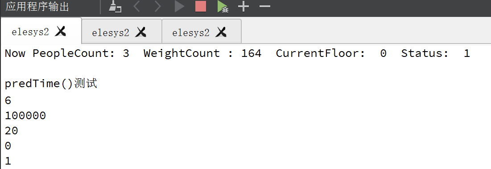
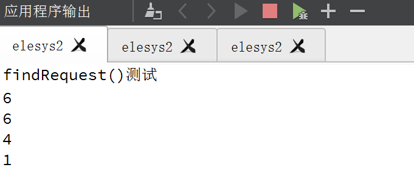
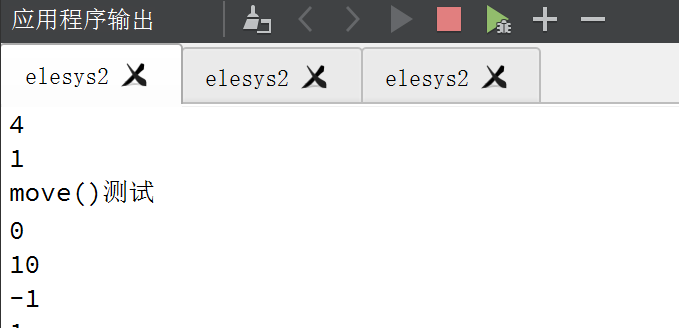
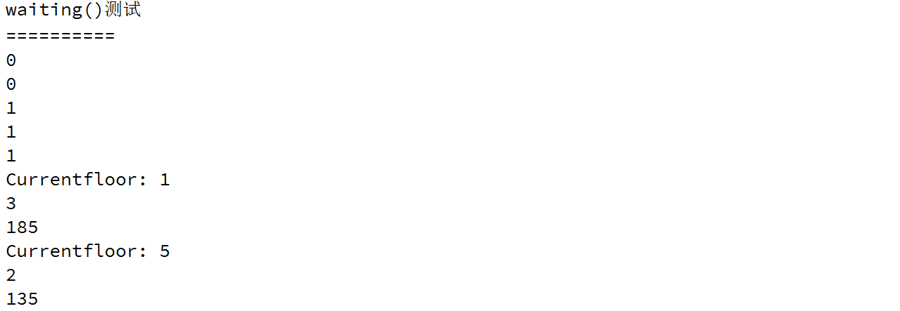
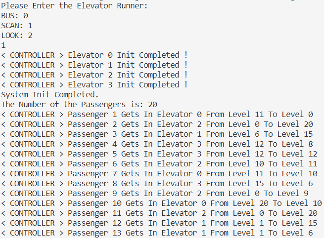
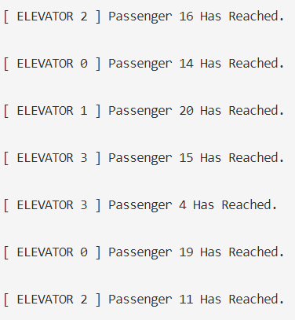
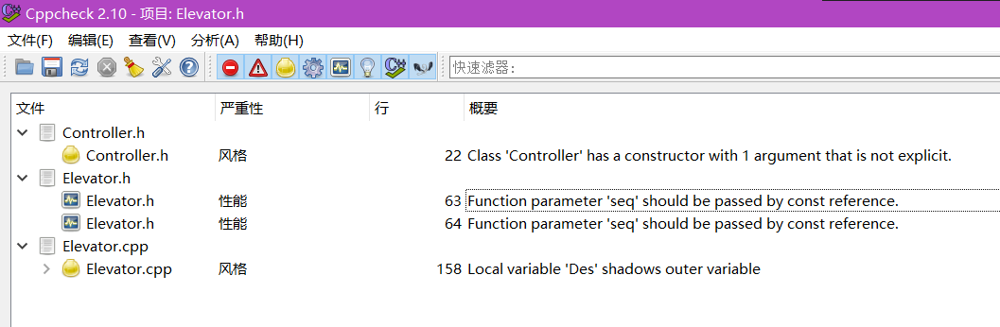

# **电梯调度-测试文档**

[toc]

## **单元测试**

我们对模型中与电梯调度关键功能有关的各项函数进行测试，主要包括 Elevator 类中的 ***predTime()*、*findRequest()*、*move()* 以及 *waiting()***。通过在QT的 ***main* 函数** 中编写相关的测试代码，测试关键函数功能的准确性。

**测试代码**通过 ***Test* 函数** 实现，在 ***Test*** 中，实例化一个 **Elevator** 对象。

+ **实例化及初始化过程**

    ```c
    Elevator* test = new Elevator(1,5,1000,0,0,1,0,5,1,2);
    test->setcurCount(3);//设置里面有3个人
    test->setcurWeight(164);//设置里面有164kg
    test->setmoveDirect(1);//设置状态为上行

    vector<int> Servefloor = {0,1,2,3,4,5,6,7,8,9,10};//服务-1-10层
    test->setServeLevel(Servefloor);
    
    //test->print();
    qDebug()<<"Now PeopleCount:" << test->getcurCount() << " WeightCount :" << test->getcurweight() << " CurrentFloor: " << test->getcurLevel() << " Status: " << test->getmoveDirect() << endl;
    ```

    初始化结果：

    

+ **predTime()测试**

    测试代码：

    ```c
    qDebug() <<"predTime()测试";
    qDebug() << test->predTime(6);//ans == 6(ans表示预期结果)
    qDebug() << test->predTime(18);//ans == 100000

    //设置AboveSeq，测试predTime()
    vector<int> Up = {6, 9};
    test->setAboveSeq(Up);
    qDebug() << test->predTime(10);//ans == 20
    qDebug() << test->getcurLevel();
    qDebug() << test->predTime(1);//ans == 1
    ```

    测试结果：

    

+ **findRequest()测试**

    测试代码：

    ```c
    vector<int> Up = {6, 9};
    test->setAboveSeq(Up);
    qDebug()<< "findRequest()测试";
    test->findRequest(10);//ans==6
    test->findRequest(8);//ans==6
    test->findRequest(4);//ans==4
    test->findRequest(1);//ans==4
    ```

    测试结果：

    

+ **move()测试**

    测试代码：

    ```c
    qDebug()<< "move()测试";
    qDebug() << test->getcurLevel();//ans = 1
    test->move(10);
    qDebug() << test->getcurLevel();//ans = 10
    test->move(-1);
    qDebug() << test->getcurLevel();//ans = -1
    ```

    测试结果：

    

+ **waiting()测试**

    测试代码:

    ```c
    qDebug()<< "waiting()测试";
    test->setcurCount(0);//重新初始化
    test->setcurWeight(0);
    test->setmoveDirect(0);//设置状态为静止

    Passenger p1(1,50,5,1);
    Passenger p2(2,70,10,1);
    Passenger p3(3,65,10,1);
    test->inEle[1].push_back(p1);
    test->inEle[1].push_back(p2);
    test->inEle[1].push_back(p3);
    qDebug() << "==========";
    qDebug() << test->getcurCount();//ans = 0
    qDebug() << test->getcurweight();//ans = 0
    test->waiting();
    qDebug() << "Currentfloor:" << test->getcurLevel();//ans = 1
    qDebug() << test->getcurCount();//ans = 3
    qDebug() << test->getcurweight();//ans = 50 + 70 + 65 = 185
    test->move(5);
    test->waiting();
    qDebug() << "Currentfloor:" << test->getcurLevel();//ans = 5
    qDebug() << test->getcurCount();//ans = 2
    qDebug() << test->getcurweight();//ans = 135
    ```

    测试结果：

    

由上可得，所有函数运行后得到的结构都与预期一致，成功通过单元测试。

## **整体测试**

我们通过整体测试对电梯调度程序的整体运行过程进行监测：检验程序是否**逻辑正确**、是否能**正常运行**、是否**满足用户需求**；对电梯调度算法进行**性能测试与分析**。

**测试代码：**

```c
/** -[性能测试]
 *  1.统计三种算法下控制系统的电梯选择方案
 *  2.每部电梯服务每位乘客所需时间以及总时间
 *  3.所用乘客从请求发出到到达目的地所花费的总时间
*/
int mode;
cout << "Please Enter the Elevator Runner:" << endl;
cout << "BUS: 0" << endl << "SCAN: 1" << endl << "LOOK: 2" <<endl;
cin >> mode;

Controller *controller = new Controller(mode);
cout << "System Init Completed." << endl;

int psgNum = ID.size();
cout << "The Number of the Passengers is: " << psgNum << endl;
for(int i = 0; i < ID.size(); ++i)
{
    Passenger psg = Passenger(ID[i], Wit[i], Des[i], Cur[i]);
    psg.setReqTime();
    controller->reqRecv(psg);
}
cout << endl << "-----------------------------------------------------------------" << endl << endl;
while(TRUE)
{
    Sleep(12000);
    int sumNum = 0;
    for(int id=0; id<4; ++id)
        sumNum += controller->elev[id]->getServedNum();
    if(sumNum == psgNum)
    {
        controller->performTest();
        break;
    }
    cout << "The Number of Served Passengers is: " << sumNum << endl;
}
```

**测试用例：**

|  ID  |  Weight(KG)  |   Destination Floor  |  Current Floor  |
|------|--------------|----------------------|-----------------|
|  **1**   |  150         |   -1                 |  11             |
|  **2**   |  90          |   20                 |   0             |
|  **3**   |  100         |   15                 |   6             |
|  **4**   |  88          |    8                 |  12             |
|  **5**   |  68          |   12                 |  12             |
|  **6**   |  79          |   11                 |  10             |
|  **7**   |  120         |   10                 |  11             |
|  **8**   |  110         |    6                 |  15             |
|  **9**   |  90          |    9                 |  -1             |
|  **10**  |  80          |   10                 |  20             |
|  **11**  |  200         |   20                 |  -1             |
|  **12**  |  100         |   15                 |   1             |
|  **13**  |  50          |    6                 |   1             |
|  **14**  |  60          |    7                 |  17             |
|  **15**  |  60          |    8                 |  19             |
|  **16**  |  55          |    9                 |  -1             |
|  **17**  |  74          |   17                 |  17             |
|  **18**  |  80          |    2                 |   9             |
|  **19**  |  75          |   -1                 |  10             |
|  **20**  |  65          |   19                 |  10             |

**程序输出：**





可以清晰看到调度器为每一位乘客选择合适的电梯；当电梯送达乘客时会播报信息。程序运行正确

**性能分析：**

以所有**乘客乘坐电梯花费的总时间**(每位乘客从发出请求到抵达目的楼层所需时间的和)作为算法性能指标。详细数据请见 **性能测试结果.txt**

    BUS  算法：666个单位时间
    SCAN 算法：127个单位时间
    LOOK 算法：114个单位时间

可以看到SCAN和LOOK明显优于BUS；LOOK的效率的确高于SCAN

## **代码质量分析**

我们利用轻量的代码质量分析工具 ***Cppcheck 2.10*** 消除所有代码警告，并尽量使程序性能达到最佳

**分析对象：**

    Controller.cpp
    Controller.h
    Elevator.cpp
    Elevator.h
    Passenger.cpp
    Passenger.h
    main.cpp
    mainwindow.cpp
    mainwindow.h
    sub_mainwindow.cpp
    sub_mainwindow.h
    configuration.h

**质量分析结果：**



可以看到代码没有任何警告信息，并且图中指出的代码风格和程序性能问题也已解决，依旧出现提示应是该软件的bug
