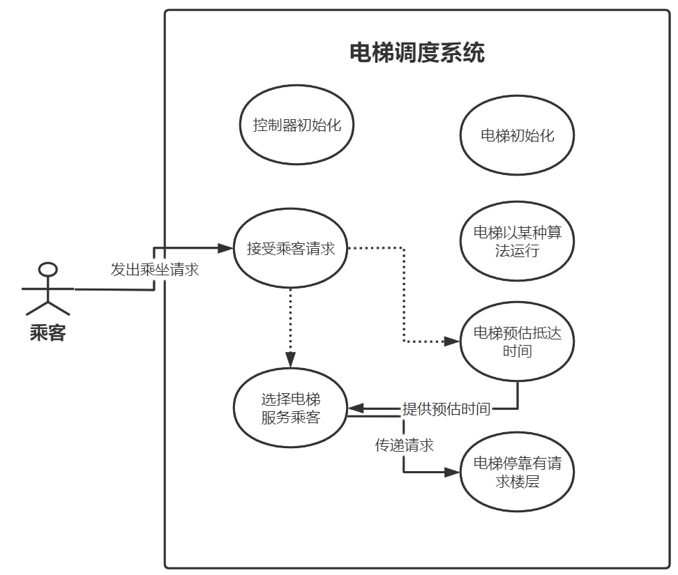

# **电梯调度-设计文档**

[toc]

## **概要说明**

### **背景**

电梯调度系统是针对多层建筑的垂直交通进行优化和改进的项目。随着城市的发展和人口的增加，高楼大厦内**电梯数量增多**，电梯的调度算法对于提高乘客的**出行效率**和舒适度变得越发重要。

### **设计目标**

“电梯调度系统”项目的设计目标是搭建一个包含**四部电梯**的大厦电梯调度系统 ，有**独立的运行系统**和**人性化的UI界面**。

+ 保证数据的**安全性、完整性和准确性**。
+ 保证系统的稳定性：系统能够长期稳定运行，并且具有**一定错误处理机制**。
+ 增加电梯的**运行效率**：通过更加合理的调度策略和优化算法，提高电梯的乘客**吞吐量，降低空载率和能耗**。

## **程序用例图**

## **接口设计**

为了满足程序功能结构 ***简单明确*** 的需求，我们最终只设计了三个类，并且尽量简化属性和接口：
  
### **A 乘客类 Passenger**

+ **属性**：乘客的当前状态信息和乘坐电梯相关参数

      1. 个人ID
      2. 体重
      3. 本人的目标楼层号
      4. 本人当前所在楼层号
      5. 当前乘坐电梯号
      6. 请求移动方向 - false下, true上
      7. 发起请求时间
      8. 花费总时间

    其中 **属性6** 可以 ***规定乘客行为*** ，直到控制系统调度到合适的电梯之前，乘客不能上任何其他电梯；**属性7** 和 **属性8** 用于***电梯调度系统性能分析***，以乘客乘坐电梯花费的总时间（从开始等待到抵达目的地）为性能指标。

+ **接口**：获取各种属性、设置请求时间、计算花费时间

### **B 电梯类 Elevator**

+ **属性**：电梯基本配置信息、当前运行状态信息和服务乘客相关信息

      1. 电梯编号：1-4
      2. 人数限制
      3. 重量限制
      4. 当前所在楼层号
      5. 当前乘坐人数
      6. 当前承载重量
      7. 已服务人数
      8. 运动方向 - 1向上，-1向下，0静止
      9. 乘客进出时长
      10. 移动一层时长
      11. 服务楼层列表 - 服务true，不服务false
      12. 上下方请求队列 (相对当前位置)
      13. 每个服务层进出电梯的乘客列表
      14. 已服务乘客列表

+ **接口**：完成乘客运输过程

      1. 设置与获取本电梯属性1-8
      2. 预估到达乘客所在楼层的运行时长
      3. 获取乘客请求
      4. 两楼层间移动
      5. 等待乘客进出
      6. 更新上下方请求队列
      7. 显示状态信息

    其中 **接口2** 用于调度系统实现 ***最短时间优先算法*** ；**接口3-6** 参与 ***实现驱动电梯的组件*** ：首先 ***findRequest*** **函数**获取乘客请求，更新上下方请求队列，然后根据请求进行楼层间移动，当前楼层有乘客请求或有乘客到达目的地则停下等待乘客进出。其中 **移动函数** ***move*** 实现两楼层间移动，**等待函数** ***waiting*** 实现乘客上下电梯。

### **C 调度器类 Controller**

+ **属性**：掌握电梯信息和调度算法选择

      1. 驱动程序模式 (三种算法)
      2. 四部电梯

+ **接口**：电梯调度和请求处理

      1. 电梯选择算法：最短时间优先算法
      2. 接收并处理乘客乘坐请求
      3. 性能分析

   其中 **接口2** 参与 ***实现驱动电梯的组件*** ：以最短时间优先算法选择一部电梯共发出该请求的乘客乘坐；**接口3** 实现 ***程序性能分析*** ：计算每部电梯所有已服务乘客的花费时间，作为该算法的性能指标。控制器以最短时间优先算法选择一部电梯共发出该请求的乘客乘坐，即 ***STFdispatch*** **函数**，以实现 ***电梯驱动*** ；当前选择的电梯不能直达乘客目的地时，调度器会选择其他电梯，***乘客无需换乘***；***performTest*** **函数**根据每部电梯提供的乘客乘坐信息，对不同算法性能进行分析

> **更新记录**
>  
> + **第一阶段** 此接口定义仅为根据目前需求所做出的初步设计，后续还会配合需求迭代以及代码实现过程及时进行修改。
>  
> + **第二阶段** 接口设置跟随需求迭代进行了更新，取消了乘客与电梯及控制程序的交互接口，增加了电梯的运行接口以及控制程序的调度接口
>  
> + **第三阶段** 接口与属性设置都跟随需求迭代进行了更新，增加了控制程序中算法选择属性和性能测试接口，增加了乘客的花费时间属性及其接口，增加了电梯的已服务乘客列表
